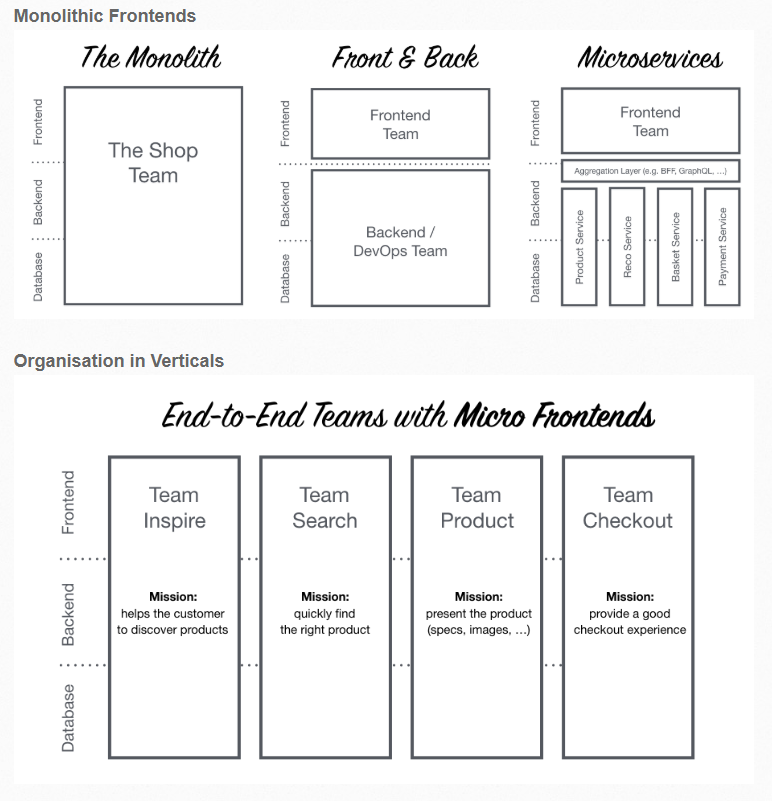

# Micro-Frontends
### What are Micro Front-Ends?

- 독립적으로 동작하는 분리된 작은 어플리케이션들 
- Reducing the risk of conflicts, bugs, and deployment delays
- Different front-end technologies without conflicting with each other
- Independent deployment cycles
